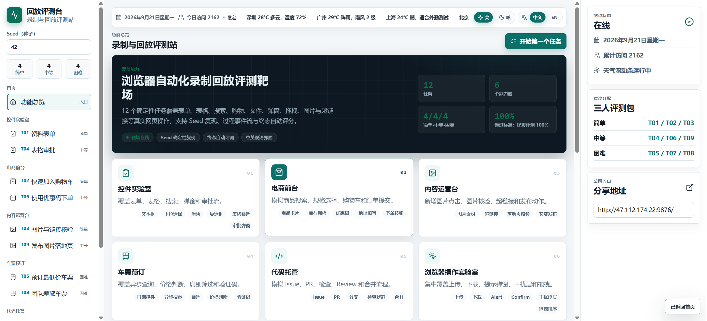

# Record & Replay Benchmark

A browser-automation record & replay proving ground. 15 deterministic tasks cover forms, tables, search, checkout, files, dialogs, drag-and-drop, images, hyperlinks, and atomic UI controls (Button, Canvas, SVG, Shadow DOM, Autocomplete, Infinite Scroll, Pagination, etc.) on a realistic local site, with seeded replay, event streams, and final-state scoring.



This workspace contains a local demo benchmark site plus a small MiniWoB++ setup for evaluating browser UI automation workflows.

## Demo Site

Install dependencies:

```bash
npm install
```

Run the local demo website:

```bash
npm run dev -- --port 5173
```

Build-check the app:

```bash
npm run build
```

Current demo tasks:

- T01 Easy: Control Lab profile form
- T02 Easy: Storefront quick add to cart
- T03 Easy: Content Desk image and hyperlink check
- T04 Medium: Control Lab table approval with modal
- T05 Hard: Ticket Booking cheapest available train reservation with mock captcha
- T06 Medium: Storefront checkout with coupon
- T07 Hard: Code Hosting issue to pull request merge
- T08 Hard: Ticket Booking team trip reservation variant
- T09 Medium: Content Desk campaign publishing and deletion
- T10 Easy: Browser Lab upload/download verification
- T11 Medium: Browser Lab dialogs and interference handling
- T12 Hard: Browser Lab full browser stress flow
- T13 Easy: Control Benchmark atomic control basics (Button, Text, Radio/Checkbox/Switch, Select, Slider, Modal, Tabs)
- T14 Medium: Control Benchmark atomic control advanced (Autocomplete disambiguation, Canvas, SVG, Shadow DOM, Drag, Infinite Scroll, Table Sort, Pagination)
- T15 Hard: Control Benchmark composite scenarios (Form query, Async list, Paginated search, Idempotent payment, Mixed UI)

The site exposes a browser-side `window.__recordReplayDemo` object with the active task, seed, state, evaluator, and event log. This keeps the first version easy to inspect while the backend API layer is still being added.

Useful public deep links:

```text
http://<frp-host>:9876/?task=control.profile-form&seed=42
http://<frp-host>:9876/?task=storefront.quick-cart&seed=42
http://<frp-host>:9876/?task=content.image-link-check&seed=42
http://<frp-host>:9876/?task=control.table-approval&seed=77
http://<frp-host>:9876/?task=tickets.reserve-cheapest&seed=77
http://<frp-host>:9876/?task=storefront.checkout-coupon&seed=19
http://<frp-host>:9876/?task=codehost.issue-pr-merge&seed=31
http://<frp-host>:9876/?task=tickets.reserve-team-trip&seed=31
http://<frp-host>:9876/?task=content.publish-campaign&seed=55
http://<frp-host>:9876/?task=browser.upload-download&seed=42
http://<frp-host>:9876/?task=browser.dialog-noise&seed=77
http://<frp-host>:9876/?task=browser.full-stress&seed=31
http://<frp-host>:9876/?task=control-benchmark.atomic-basic&seed=42
http://<frp-host>:9876/?task=control-benchmark.atomic-advanced&seed=55
http://<frp-host>:9876/?task=control-benchmark.composite-scenarios&seed=31
```

Record & Replay evaluation flow:

1. Open one of the public deep links.
2. Start recording in the target agent.
3. Have the tester complete the task using the visible instruction.
4. Stop recording and let the agent create a skill from the workflow.
5. Reset the same task, optionally with a different seed.
6. Replay the generated skill.
7. Click **评测** or inspect `window.__recordReplayDemo.report()` to check final-state success.

The demo website only provides the realistic task surface, deterministic state, event log, and final-state evaluator. Skill generation and replay happen in the external agent, not inside the website.

Realism features currently included:

- Shareable task URLs with deterministic `task` and `seed`
- Hidden results until users submit search actions
- Simulated loading states for search flows
- Disabled final-action buttons until required business preconditions are met
- Toast/status updates after meaningful workflow events
- Mock captcha and payment-safe placeholders
- Real file input upload surface
- Browser-triggered Blob downloads
- In-page alert, approval-code, and confirmation dialogs by default, with optional native `alert`/`confirm` mode
- Cookie-style banner, helper widget, and survey modal interference
- Scrollable long list selection
- HTML5 drag-and-drop ordering
- Deterministic final-state evaluator and downloadable JSON report

## Tester Runbook

Suggested assignment for three testers:

- Tester A: T01, T04, T05, T10, T13
- Tester B: T02, T06, T07, T11, T14
- Tester C: T03, T08, T09, T12, T15

Recommended baseline seed:

- Use seed `42` for the first recording pass.
- Re-run the generated skill with another seed such as `77` or `31` to test robustness.

Pass criteria:

- Click the visible **Evaluate / 评测** button after a replay.
- A task is ready only when the large banner says **Task passed / 任务通过** and score is **100%**.
- Agents can also read `window.__recordReplayDemo.report()` for task id, seed, state, event log, and final evaluator output.

Important operation notes:

- Ticket tasks use a plain `YYYY-MM-DD` text date field. Type the exact date shown in the instruction, then set departure filter to **All day / 全天** before selecting the cheapest matching train.
- Browser Lab upload tasks include a real file input. For deterministic replay, click **Download sample**, then click **Use downloaded sample / 使用已下载样例** before parsing. Agents that support file chooser replay may also use the real file input.
- Browser Lab dialogs default to in-page dialogs so record and replay can capture them consistently. Add `&nativeDialogs=1` to T11/T12 URLs only for a separate native `alert`/`confirm` compatibility test.
- Content publishing creates a mock published page and provides a delete button; deletion is optional for T09 pass/fail unless specifically testing cleanup.
- Control Benchmark (T13–T15) covers 21 atomic controls and 12 composite scenarios. The Autocomplete control includes similar candidates (e.g., 北京 / 北京东 / 北京南) — select the exact target. Shadow DOM requires entering text inside an open shadowRoot. Canvas requires clicking within the blue circle's hit area. Infinite Scroll lists all items; find and click the target item (e.g., ITEM-073). Pagination target is on page 4 (TARGET-P4-03). The S11 payment modal must be confirmed exactly once; duplicate confirms are blocked. S12 Mixed UI requires completing Shadow DOM, Canvas, and SVG before clicking the check button.

## Setup

```bash
python3 -m venv .venv
source .venv/bin/activate
python -m pip install --upgrade pip
python -m pip install -r requirements-miniwob.txt
```

MiniWoB++ needs Chrome or Chromium. If the smoke test cannot start a browser, install Chrome and rerun it.

## Smoke Test

Run headless:

```bash
.venv/bin/python scripts/miniwob_smoke.py
```

Show the browser window:

```bash
.venv/bin/python scripts/miniwob_smoke.py --headed
```

The smoke test opens `miniwob/click-test-2-v1`, reads the instruction, clicks the target button, and prints the reward and success flag.

## Regression Tests

Two complementary checks verify that every task can be completed through the real UI:

### Preflight (logic-only, no browser)

Builds the task bundle, constructs the "fully completed" state for each task across 30 seeds, and asserts the final-state evaluator returns 100% for every combination.

```bash
npm run preflight
```

### E2E smoke (real browser, full UI flow)

Drives Chrome via Selenium to click, type, select, drag, and submit all 15 tasks on the README's recommended seeds, then asserts each one reaches a 100% final-state score. Requires Chrome and the `.venv` setup from the Setup section.

```bash
# 1. Start the preview server in one terminal
npm run preview

# 2. Run the smoke test in another terminal
npm run e2e:smoke
```

Expected output ends with:

```text
T01: 1  T02: 1  T03: 1  T04: 1  T05: 1  T06: 1
T07: 1  T08: 1  T09: 1  T10: 1  T11: 1  T12: 1
T13: 1  T14: 1  T15: 1
ALL PASS
```

## Evaluation Notes

For Record & Replay, start with deterministic, short tasks such as:

- `click-test-2`
- `click-button`
- `enter-text`
- `focus-text`
- `click-checkboxes`
- `choose-list`
- `click-menu`
- `use-slider`
- `copy-paste`
- `form-sequence`

Track success rate, average reward, steps to success, timeout rate, invalid action rate, and robustness across different seeds.
